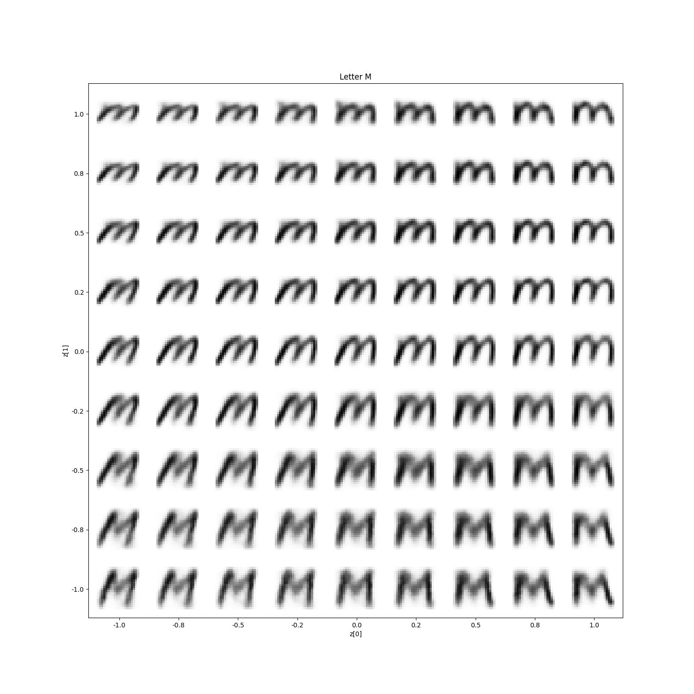

# Handwritten-Characters-CVAE
Handwritten character generator using Conditional VAE.  
Created as an imporvement to the Handwritten Character VAE project, this one creates images of handwritten characters of better quality.

## Dataset

The dataset used for training is available at [Kaggle](https://www.kaggle.com/datasets/sachinpatel21/az-handwritten-alphabets-in-csv-format).

## Results

Contrary to VAE model, CVAE is capable of producing legible results for all the letters present in the dataset. 
Example of letter 'm' generated by CVAE:

The created result is unequivocal, contrary to most of the characters generated by the VAE model.  
Here in the latent space we can see the changes in the inclination of the letter, as well as the sharpness of tips in it. 
